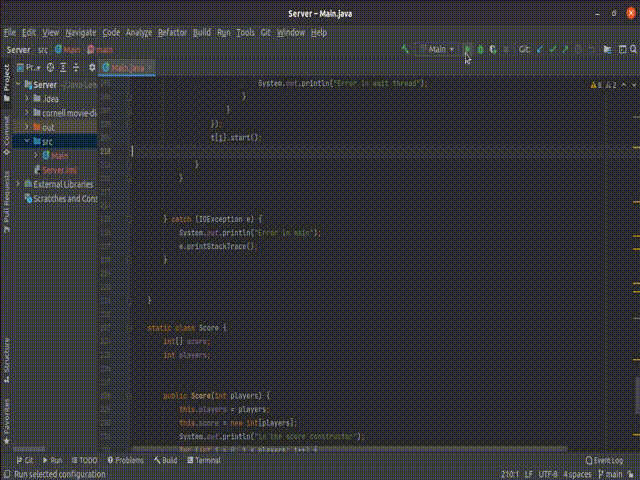

# Chatbot-Game-v.3

>Client-Server java chatbot to demonstrate a client-server application used to play a game. The client-side has a GUI and communicates with the server to play this game. In this third iteration, you can connect multiple Clients to the Server. 

---

## Table of Contents

- [Description](#description)
- [Usage](#usage)
- [Project Development and Working](#project-development-and-working)
- [Improvements](#improvements)
- [License](#license)
- [Author Info](#author-info)

---

## Description

This application is development on the [Chatbot v.1](https://github.com/taher-mulla/Chatbot-Game-v.1.git) and [Chatbot v.2](https://github.com/taher-mulla/Chatbot-Game-v.2). I have improved this to have multiple clients connect to one server at a time. So basically multiple people can play this game together. The clients will communicate with the server and will be given the questions, the answers, and the score. I am no more using the movie's database as the program was getting very complicated, in this project I am just using basic math questions to be asked to the client. This project should be looked at as a demonstration or example of how to write a multi-client-server application, exchange data between them, etc. To look at or understanding individual parts of this project such as client-server application, threads, using a database, JavaFX, etc, pls refer to my repository [here](https://github.com/taher-mulla/Java.git). You can see codes from different java topics here. 

#### Technologies

- Thread Management
- Sockets
- JavaIO
- JavaFX
- JavaNIO
- Basic Java

[Back To The Top](#chatbot-game-v3)

---

## Usage

Pls download the Clients And Server files and open the projects in any IDE. It is possible that JavaFX is not supported by your platform and you may need to import the jar files externally. After this pls run the server then enter the number of the clients, then run the clients. 

Note:  
- the client and server are currently configured to run on localhost on port 5000, pls change this if you want to test running it on different machines.

[Back To The Top](#chatbot-game-v3)

---

## Project Development and Working

#### User Interface (Client) 

  The user interface is made using JavaFX. The top-level is a BorderPane, we use the top, center, and bottom of this view for the interface. 

  - Top

	  The top is used and created in the controller, it is the only part of the interface that has not been coded in the .fxml file. It is used to keep the score and has a VBox in it for the scores. The TextFields are updated every time the score changes through the controller. You can improve the code by binding the variable to the text in the VBox.

  - Center 

	  The TextArea here is used for the conversation messages, it is appended here every time the server or used sends a message.

  - Bottom

 	  Here a BorderPane is used with a TextField and  Button. 

#### Working

- Client-Side
 
  The client has a GUI for better user interaction. The fx-controller initialize() method displays the initial message and then connects with the server. From here the server will be in control and it will determine whose turn it is and will accordingly send a question to the respective client. The send button in the GUI will send the typed string to the server, and the server will give the appropriate reply. 
  
  Every string sent from the server to the client has multiple parts. Using this string the server tells the client: who has sent the message, the message content, the individual client score. This string is one example of how the clients and server can exchange data and communicate. 
  
  Pls refer to the client src code [here](Client/src/sample).

- Server Side

  The server does not need a GUI and hence has none. Initially, the server asks the user the number of clients that want to connect. Till all the clients connect no one can send messages to the server - each client is put on a thread that runs a loop to detect and messages and send a "wait" reply. After this, if a client sends a message out of turn also a "wait" text is sent to it. The client can only send texts to the server during its turn. The server also keeps the score and sends the same to the clients with every message. 
  
  Pls, refer to the server src code [here](Server/src).

[Back To The Top](#chatbot-game-v3)

---

## Improvements

There are multiple possible improvements possible in the UI. Also using data-binding in the VBox would be very beneficial. The client should also be able to change their names and answer in full sentences.

[Back To The Top](#chatbot-game-v3)

---

## License

[Here](LICENSE)

[Back To The Top](#chatbot-game-v3)

---

## Author Info

 - [Linkdin](www.linkedin.com/in/taher-mulla-8b9546136) 

 - [GitHub](https://github.com/taher-mulla)

 - Email - taher.mulla@gmail.com

[Back To The Top](#chatbot-game-v3)

